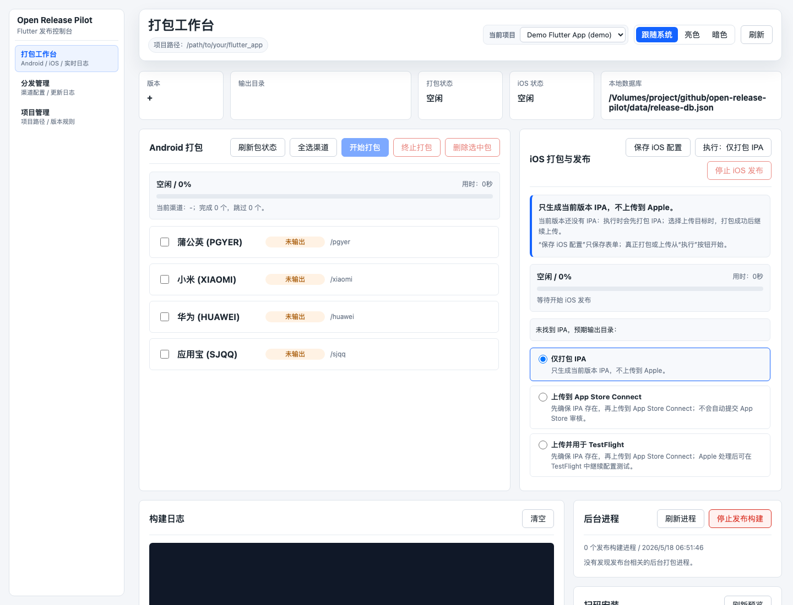
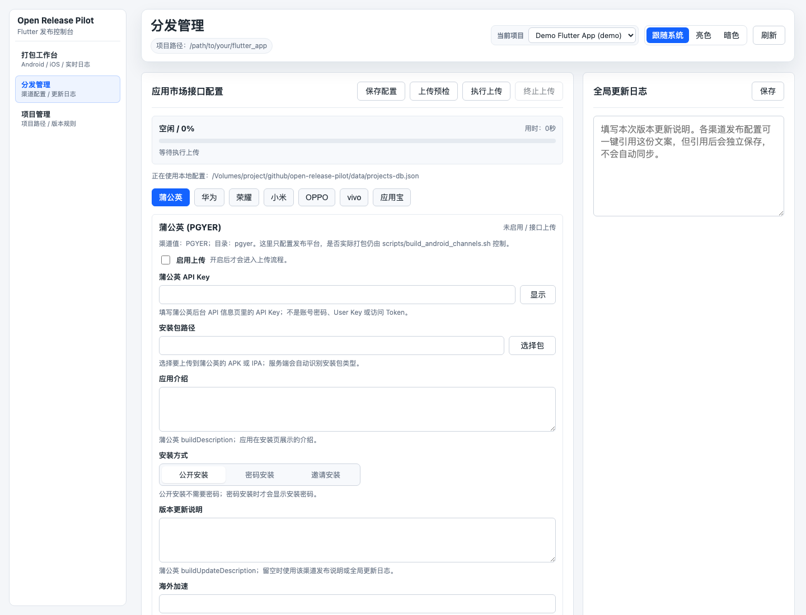
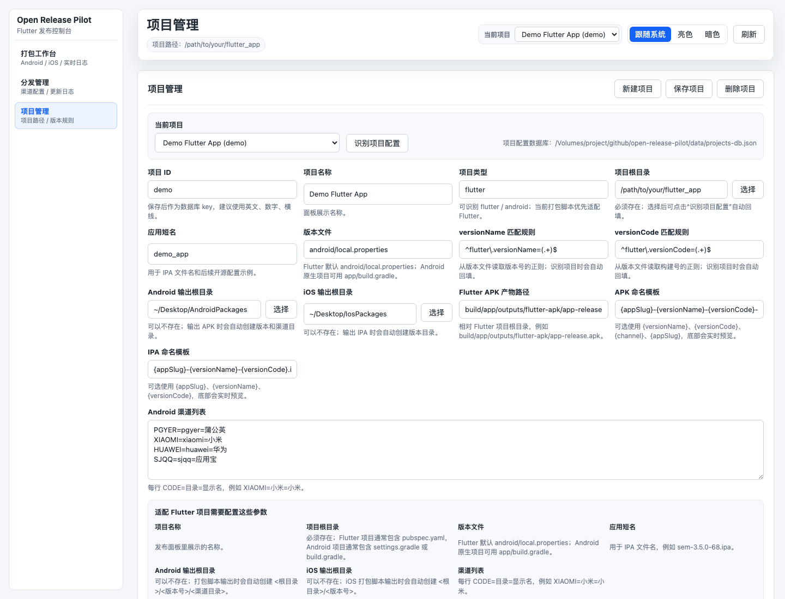

# Open Release Pilot

[中文](./README.md) | [English](./README_EN.md)

Open Release Pilot 是一个面向 Flutter 应用的本地可视化发布控制台。它把项目配置、Android 多渠道打包、iOS IPA 构建、应用市场上传配置、发布记录和局域网扫码安装预览集中在一个本地 Web 面板里。

项目地址：<https://github.com/langyuxiansheng/open-release-pilot>

## 适用场景

- 你有一个或多个 Flutter App，需要固定流程打 Android 渠道包。
- 你希望把 iOS IPA 构建、App Store Connect 上传参数和历史记录放在同一个本地工具里管理。
- 你需要为蒲公英、华为、小米、应用宝等渠道维护发布参数、包路径、审核备注和更新说明。
- 你不想部署数据库或后台服务，只想在自己的电脑上运行一个发布面板。

## 功能概览

- 项目管理：维护多个 Flutter/Android 项目根目录、版本文件、输出目录、渠道列表和包名模板。
- Android 打包：按渠道勾选构建正式 APK，展示进度、日志、输出路径，并支持终止任务和删除当前版本渠道包。
- iOS 发布：支持仅构建 IPA、构建后上传 App Store Connect、构建后用于 TestFlight 的流程配置。
- 分发管理：维护应用市场配置、渠道发布说明、审核备注、素材路径和上传历史。
- 本地数据：项目配置、发布记录和敏感参数默认写入 `data/` 或本地配置文件，不依赖远程数据库。
- 扫码安装：对当前版本 Android 包生成局域网访问入口，方便同网设备测试安装。
- 主题切换：支持跟随系统、亮色、暗色。

## 界面预览

### 打包工作台



### 分发管理



### 项目管理



## 技术栈

- Node.js 原生 HTTP 服务，无 Express 依赖。
- 静态 HTML/CSS/ES Modules 前端，无构建步骤。
- Shell 脚本执行 Android/iOS 构建。
- JSON 文件作为本地持久化存储。

## 环境要求

| 依赖 | 要求 |
| --- | --- |
| Node.js | `>= 18` |
| npm | 只用于执行 `npm start`，项目当前没有第三方依赖 |
| Flutter | 执行 Android/iOS 构建时需要目标项目已配置 Flutter SDK |
| Android 构建环境 | 打 Android 包时需要 Android SDK、Gradle、签名配置等由目标 Flutter 项目自行准备 |
| Xcode | 打 iOS IPA 或上传 App Store Connect 时需要 macOS + Xcode 工具链 |

## 快速开始

```bash
git clone https://github.com/langyuxiansheng/open-release-pilot.git
cd open-release-pilot
npm start
```

启动后终端会打印本机访问地址，例如：

```text
Open Release Pilot: http://127.0.0.1:8787
Open Release Pilot LAN: http://192.168.1.10:8787
```

首次打开后进入「项目管理」，把示例项目根目录替换成你的 Flutter 项目路径。

## 启动命令

| 命令 | 说明 |
| --- | --- |
| `npm start` | 启动本地发布面板，等同于 `./start.sh` |
| `npm run start:raw` | 直接执行 `node server.js`，不做端口检查 |
| `./start.sh --port 8788` | 指定端口启动 |
| `./start.sh --status` | 查看当前端口占用 |
| `./start.sh --stop` | 停止当前端口上的 Open Release Pilot 服务 |
| `./start.sh --kill-port` | 端口被当前项目旧服务占用时先停止再启动 |

## 目录结构

```text
open-release-pilot/
├── config/
│   └── stores.example.json          # 应用市场配置示例，不包含真实密钥
├── data/                            # 本地运行数据，默认被 Git 忽略
├── public/                          # 前端页面、样式和模块
├── scripts/
│   ├── build_android_channels.sh    # Android 多渠道构建脚本
│   ├── build_ios_release.sh         # iOS IPA 构建脚本
│   └── start_panel.sh               # 本地服务启动脚本
├── server/                          # Node.js 服务端模块
├── server.js                        # 服务入口
├── start.sh                         # 根目录启动入口
├── package.json
└── README.md
```

## 页面说明

| 页面 | 说明 |
| --- | --- |
| 打包工作台 | 查看版本、输出目录、本地数据库路径，执行 Android/iOS 打包，查看日志、后台进程和扫码安装预览 |
| 分发管理 | 维护应用市场接口配置、全局更新日志、各渠道发布说明和上传记录 |
| 项目管理 | 维护多个目标项目的根目录、版本规则、输出目录、命名模板和渠道列表 |

## 本地数据和配置文件

| 文件 | 是否建议提交 | 说明 |
| --- | --- | --- |
| `config/stores.example.json` | 是 | 开源示例配置，只能放占位值 |
| `config/stores.local.json` | 否 | 可选的本机初始化配置，适合放个人账号、密钥、包名等敏感信息 |
| `data/projects-db.json` | 否 | 当前项目列表、每个项目的 iOS 配置和商店配置 |
| `data/release-db.json` | 否 | 版本记录、Android 包扫描结果、构建记录、上传记录 |
| `data/*.log` / `data/*.tmp` | 否 | 本地运行过程中的日志或临时文件 |

`.gitignore` 已默认忽略本地数据、安装包、签名文件和常见密钥文件。开源发布前仍建议自己再扫描一遍仓库，确认没有真实 App ID、Bundle ID、Apple Team ID、API Key、测试账号、手机号、私有路径或发布备注。

## 环境变量

| 变量 | 默认值 | 说明 |
| --- | --- | --- |
| `PORT` | `8787` | 本地 HTTP 服务端口 |
| `HOST` | `0.0.0.0` | 服务监听地址；保持默认可让同一局域网设备访问扫码安装页 |
| `RELEASE_PROJECT_ROOT` | 空 | 目标 Flutter 项目根目录，优先级高于 `FLUTTER_PROJECT_ROOT` |
| `FLUTTER_PROJECT_ROOT` | 空 | 目标 Flutter 项目根目录 |
| `PROJECT_ROOT` | 空 | 兼容旧配置的目标项目根目录 |
| `BUILD_CHANNELS` | 空 | Android 脚本使用，逗号分隔渠道，例如 `PGYER,XIAOMI` |
| `ORP_ANDROID_OUTPUT_ROOT` | `~/Desktop/AndroidPackages` | Android 渠道包输出根目录 |
| `ORP_IOS_OUTPUT_ROOT` | `~/Desktop/IosPackages` | iOS IPA 输出根目录 |
| `ORP_ANDROID_APK_SOURCE` | `build/app/outputs/flutter-apk/app-release.apk` | Flutter 构建完成后的源 APK 路径 |
| `ORP_APP_SLUG` | `app` | 输出文件名里的应用短名 |
| `ORP_APK_NAME_TEMPLATE` | `release-{versionName}-{versionCode}-{channel}.apk` | Android APK 文件名模板 |
| `ORP_IPA_NAME_TEMPLATE` | `{appSlug}-{versionName}-{versionCode}.ipa` | iOS IPA 文件名模板 |
| `ORP_VERSION_NAME` | 自动识别 | iOS 脚本版本名兜底输入 |
| `ORP_VERSION_CODE` | 自动识别 | iOS 脚本构建号兜底输入 |
| `IOS_EXPORT_OPTIONS_PLIST` | `ios/AdHocExportOptions.plist` | iOS 导出配置 |
| `IOS_OUTPUT_DIR` | 空 | 指定本次 iOS IPA 输出目录 |

## 项目配置项

项目配置保存在 `data/projects-db.json`。建议优先在「项目管理」页面编辑，手动改 JSON 时要保持字段类型正确。

| 字段 | 类型 | 说明 |
| --- | --- | --- |
| `id` | string | 项目唯一 ID，只建议使用字母、数字、下划线或短横线 |
| `name` | string | 面板里展示的项目名称 |
| `type` | string | `flutter`、`android` 或 `unknown` |
| `rootPath` | string | 目标 Flutter/Android 项目根目录 |
| `appSlug` | string | 输出文件名使用的应用短名 |
| `versionFile` | string | 相对 `rootPath` 的版本文件，Flutter 默认 `android/local.properties` |
| `versionNamePattern` | string | 从版本文件提取版本名的正则，必须有第一个捕获组 |
| `versionCodePattern` | string | 从版本文件提取构建号的正则，必须有第一个捕获组 |
| `androidOutputRoot` | string | Android 渠道包输出根目录 |
| `iosOutputRoot` | string | iOS IPA 输出根目录 |
| `androidApkSource` | string | Flutter/Gradle 构建后生成的源 APK 相对路径 |
| `apkNameTemplate` | string | APK 文件名模板，支持 `{appSlug}`、`{versionName}`、`{versionCode}`、`{channel}` |
| `ipaNameTemplate` | string | IPA 文件名模板，支持 `{appSlug}`、`{versionName}`、`{versionCode}` |
| `channels` | array | Android 渠道列表，每项包含 `code`、`dir`、`name` |
| `iosConfig` | object | 当前项目的 iOS 发布配置 |
| `stores` | object | 当前项目的应用市场配置 |

渠道配置示例：

```json
[
  { "code": "PGYER", "dir": "pgyer", "name": "蒲公英" },
  { "code": "XIAOMI", "dir": "小米", "name": "小米" },
  { "code": "HUAWEI", "dir": "华为", "name": "华为" }
]
```

命名模板示例：

```text
{appSlug}-{versionName}-{versionCode}-{channel}.apk
{appSlug}-{versionName}-{versionCode}.ipa
```

## iOS 发布配置项

| 字段 | 说明 |
| --- | --- |
| `releaseTarget` | 发布目标：`build-only`、`app-store-connect`、`testflight` |
| `exportOptionsPlist` | 仅构建 IPA 时使用的 ExportOptions plist |
| `appStoreExportOptionsPlist` | 上传 App Store Connect/TestFlight 时使用的 ExportOptions plist |
| `outputDir` | 指定 IPA 输出目录；为空时使用项目的 `iosOutputRoot/versionName` |
| `appStoreConnectUploadTool` | 上传工具说明字段，默认 `xcrun altool` |
| `appleKeyId` | App Store Connect API Key ID |
| `appleIssuerId` | App Store Connect Issuer ID |
| `applePrivateKeyPath` | `.p8` 私钥路径，建议使用本机私有路径 |
| `bundleId` | iOS Bundle ID |
| `appAppleId` | Apple 后台 App ID |
| `teamId` | Apple Team ID |
| `testFlightBetaNote` | TestFlight 测试说明 |
| `skipExistingIpa` | 目标 IPA 已存在时是否跳过重复打包 |

## 应用市场配置项

应用市场字段由 `server/config.js` 中的 `STORE_FIELD_SCHEMAS` 定义，前端会按 schema 自动渲染。开源示例只提供占位值，真实密钥请放在本机配置或页面保存后的 `data/projects-db.json`，不要提交。

| 平台 | 自动化能力 | 关键配置 |
| --- | --- | --- |
| 蒲公英 `pgyer` | API 上传 | `enabled`、`apiKey`、`apkPath`、`buildDescription`、`installType`、`password`、`buildUpdateDescription`、`releaseNotes` |
| 华为 `huawei` | API 参数模板 | `enabled`、`clientId`、`clientSecret`、`appId`、`packageName`、`apkPath`、`releaseType`、`submitForReview`、`releaseNotes` |
| 小米 `xiaomi` | API 参数模板 | `enabled`、`baseUrl`、`userName`、`publicKey`、`privateKey`、`packageName`、`apkPath`、`appName`、`privacyUrl`、`testAccountJson` |
| 应用宝 `sjqq` | API 更新应用信息 | `enabled`、`user_id`、`access_secret`、`pkg_name`、`app_id`、`apkPath`、`feature`、`deploy_type`、`login_account` |
| 荣耀 `honor` | 人工上传模板 | `developerUrl`、`account`、`appId`、`packageName`、`apkPath`、`iconPath`、`screenshotPaths`、`privacyUrl` |
| OPPO `oppo` | 人工上传模板 | `developerUrl`、`account`、`appId`、`packageName`、`apkPath`、`iconPath`、`screenshotPaths`、`privacyUrl` |
| vivo `vivo` | 人工上传模板 | `developerUrl`、`account`、`appId`、`packageName`、`apkPath`、`iconPath`、`screenshotPaths`、`privacyUrl` |

通用字段说明：

- `enabled`：是否纳入上传/预检流程。
- `apkPath`：本地 APK 路径，可通过页面文件选择器填写。
- `releaseNotes`：渠道发布说明，和全局更新日志独立保存。
- `auditNotes`：给审核人员看的说明，例如测试账号、权限说明、特殊审核路径。
- `submitForReview`：上传后是否提交审核。真实自动发布前建议先关闭，避免误提交。
- `clientSecret`、`apiKey`、`privateKey`、`access_secret`：敏感字段，只能保存在本机。

## API 概览

| 接口 | 方法 | 说明 |
| --- | --- | --- |
| `/api/status` | GET | 页面完整状态快照，包含项目、版本、包扫描、本地数据库和商店配置 |
| `/api/projects/save` | POST | 保存项目配置 |
| `/api/projects/active` | POST | 切换当前项目 |
| `/api/projects/inspect` | POST | 根据本机路径识别 Flutter/Android 项目 |
| `/api/notes` | POST | 保存当前版本全局更新日志 |
| `/api/build` | POST | 启动 Android 渠道打包 |
| `/api/build/progress` | GET | 获取 Android 打包进度 |
| `/api/build/events` | GET | Android 构建日志 SSE |
| `/api/packages/delete` | POST | 删除当前版本选中渠道包 |
| `/api/ios-config` | POST | 保存 iOS 发布配置 |
| `/api/ios-release` | POST | 启动 iOS 构建/上传 |
| `/api/ios-release/progress` | GET | 获取 iOS 发布进度 |
| `/api/ios-release/events` | GET | iOS 构建/上传日志 SSE |
| `/api/store-config` | POST | 保存应用市场配置 |
| `/api/upload` | POST | 执行应用市场上传或预检 |
| `/api/upload/progress` | GET | 获取应用市场上传进度 |
| `/api/upload-runs/delete` | POST | 删除单条上传记录 |
| `/api/install-preview` | GET | 获取扫码安装预览 |
| `/api/processes` | GET | 查看发布相关后台进程 |

## Android 构建流程

`scripts/build_android_channels.sh` 会进入目标项目目录，读取版本号，按渠道执行：

```bash
flutter build apk --release --dart-define="TAG_CHANNEL=${CHANNEL}"
```

每个渠道构建完成后，会把源 APK 复制到：

```text
{androidOutputRoot}/{versionName}/{channel.dir}/{apkNameTemplate}
```

脚本支持断点续打：目标渠道包已存在且非空时会跳过该渠道。如需强制重打，先在面板里删除对应渠道包，或手动删除目标 APK。

## iOS 构建流程

`scripts/build_ios_release.sh` 会进入目标项目目录，读取版本号并执行：

```bash
flutter build ipa --export-options-plist="$IOS_EXPORT_OPTIONS_PLIST"
```

构建成功后会把 `build/ios/ipa/*.ipa` 复制到：

```text
{iosOutputRoot}/{versionName}/{ipaNameTemplate}
```

当 `releaseTarget` 为 `app-store-connect` 或 `testflight` 时，服务端会在 IPA 存在后调用 `xcrun altool` 上传。上传所需的 API Key 和私钥必须保存在本机。

## 安全建议

- 不要提交 `data/*.json`、`config/stores.local.json`、`.env`、签名文件、证书、`.p8`、`.p12`、`.mobileprovision`。
- 不要把真实应用包名、Apple Team ID、App Store Connect API Key、应用市场密钥、测试账号密码写入开源示例。
- 面板会提供本机文件浏览能力，只建议在可信内网运行，不建议暴露到公网。
- `HOST=0.0.0.0` 方便局域网扫码安装；如果只想本机访问，可以用 `HOST=127.0.0.1 npm start`。
- 上传前建议先关闭 `submitForReview`，确认接口和包体无误后再提交审核。

## 开源声明

Open Release Pilot 是开源项目，仓库地址为：

<https://github.com/langyuxiansheng/open-release-pilot>

本项目采用 [Apache License 2.0](./LICENSE) 开源。你可以在遵守许可证的前提下使用、复制、修改、分发或二次开发本项目。

Copyright (c) 2026 langyuxiansheng.
